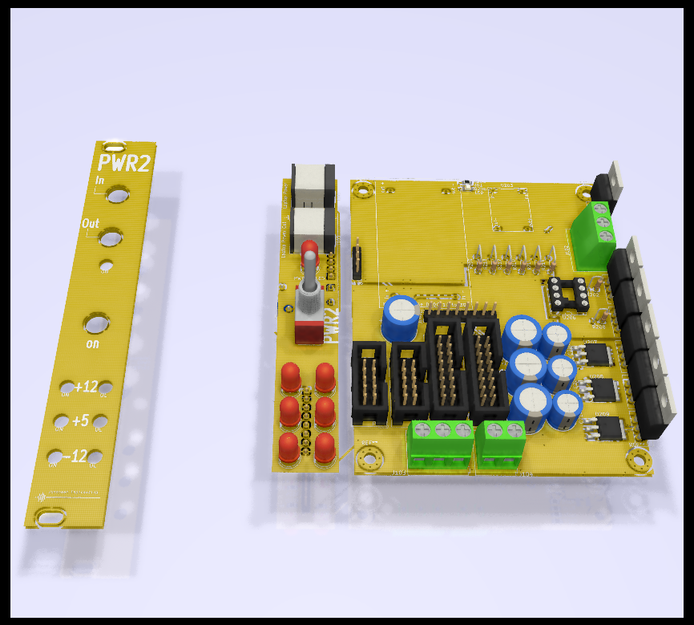
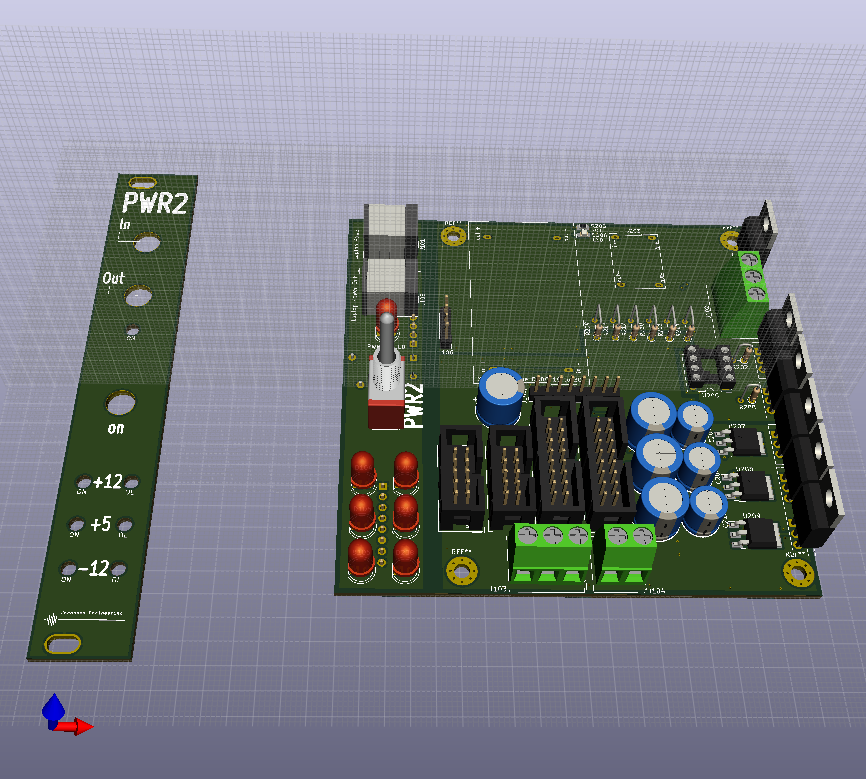
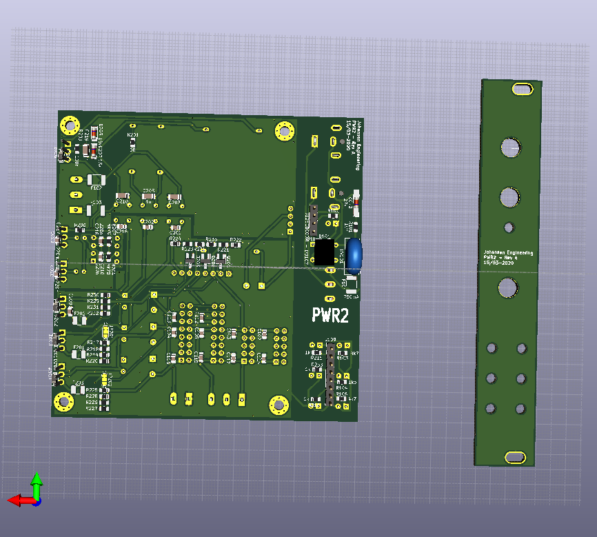
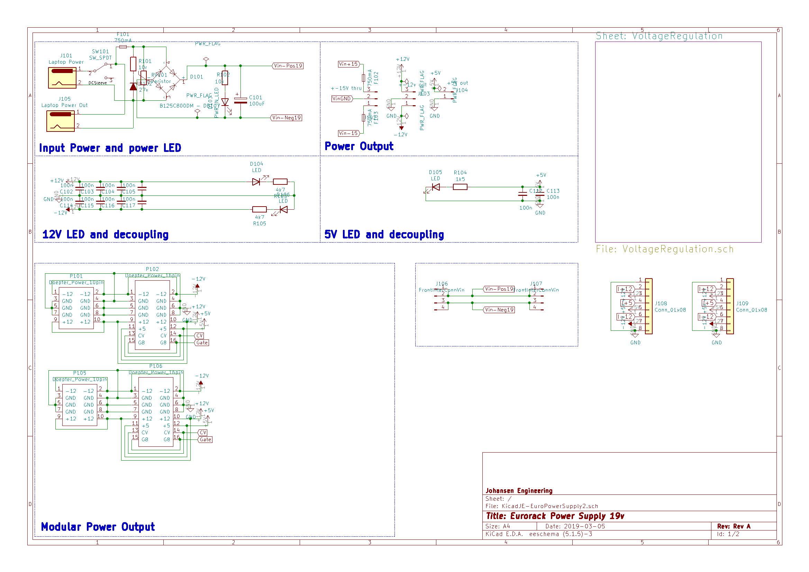
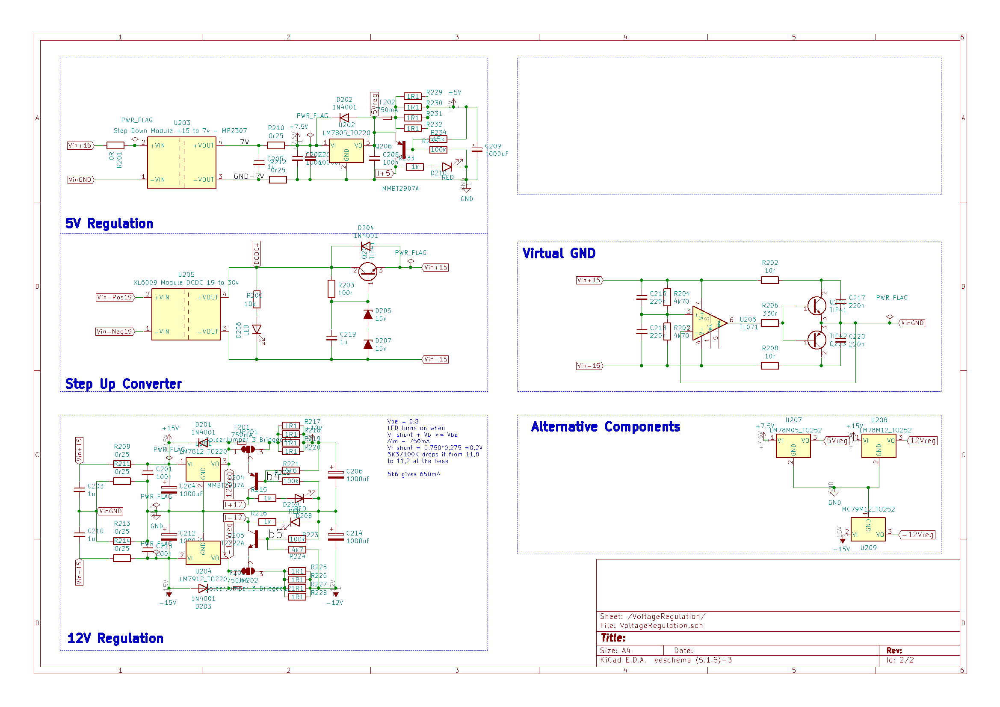

# KicadJE-EuroPowerSupply2
4HP PSU faceplate with 80x100mm PSU + PDU board. Faceplate input from a laptop PSU (19V) and may be daisychained to the next Eurorack unit.

Please note this method of making +- 12v could be impaired by the laptop PSU ground connection. Some PSU's connect earth to GND (sleeve) which will be connected to -12v and not GND in this circuit. If the laptop PSU only has 2 pins or the 3rd pin is not connected to the sleeve of 19v supply there will be no issues with this design.

There is a third version that does not rely on a laptop supply in the making (2025 Q1)

# Vital Components

# Status - mounted in rack
## Initial 
| Stage  | Detail | Status |
| ------------- | ------------- | ------------- |
| create material  | sch | done |
| | pcb | done |
| | gerber | done |
| production  |   | done |
|  | produced | done |
|  | delivered | done |
## Preliminary validation
| Test  | Detail | Status |
| ------------- | ------------- | ------------- |
| Initial Inspection | | good alignment w panel - panel: pwr holes 2 mm too small |
| Initial Technical Test |  | OL LED's lighting up without load - probably due to the extra resistance of the polyfuse |
| Initial Technical Test |  | OL LED's ok with 2k2 but unsure of how they work now - 3k9 is ok without load but makes a bit of a light at a few XX mA |
| Initial Technical Test |  | input fuse experienced a few problems after shoring the input of the DC-DC by mistake
| Initial Product Test |  | ok - Powers the uP DAC nicely|

## Secondary validation
| Test  | Detail | Status |
| ------------- | ------------- |------------- |
| Product Test |  | |
| Product Test |  | |
| Quality |  | |
| Quality | | |
| Long Term Product Test |  | Working for a year without stability issues | 
|  | | Bridge recitifier gets warm/hot |
| Power Draw | up to 750mA 19V | 

## Errata
### Errata - 
Holes for Pwr in and out are 2mm too small in face plate

Place DCDC input further away from electronics on the backside - risky location

## Issues and Notes
### Front
There is just enough room on the front PCB to add a JST header for power feed to baseboard.

### Regulation
Input cap C101 = 470uF/50V

Reg input cap C207 - 470uF/16V for 5V

Reg input cap C204 C212 - 100uF/35V for +-12V

Reg output cap C206 C209 C214 - 470uF/16V for all

### Output
Only half the headers has decoupling caps

Place +/-15v header away from heatsink area.

### Overload Circuit
Not easy to measure the OL circuit as it is VERY close to the DC-DC input  
Add current limiter on input and consider changing from OL to currentlimier with limit indication  
OL LED's ok with 2k2 but unsure of how they work now - 3k9 is ok without load but makes a bit of a light at a few XX mA  

### Extensions
Consider calc initial regulator stage as Capacitor multiplier and add small signal BJT in darlington config.
 - https://www.google.com/search?q=eeblog+david+jones+capacitor+multiplier&oq=eeblog+david+jones+capacitor+mul&aqs=chrome.1.69i57j33.18679j1j7&sourceid=chrome&ie=UTF-8

# Pictures

## Rendered

# Schematic

## Prototype

# Inspiration
## Rev 1
https://github.com/promesoft/KicadJE-EuroPowerSupply
